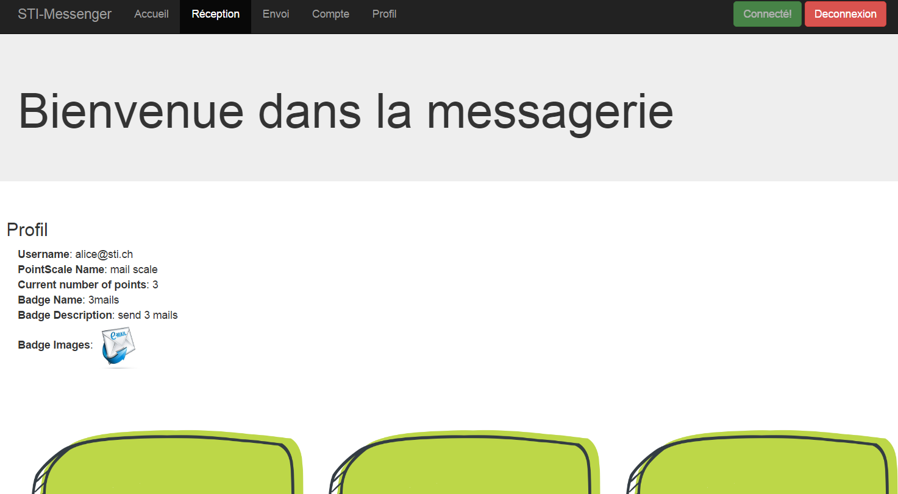
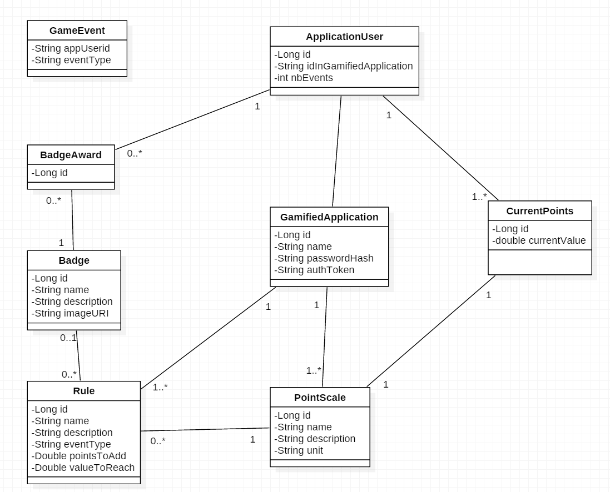

# AMT_GamificationProject

## Authors: ALBASINI Romain - CIANI Antony - HERNANDEZ Thomas - SELIMI Dardan

## Description
This project is part of the AMT course taught at HEIG-VD by professor Olivier Liechti.

It consists in a gamification platform which potentially can be used by a third-party application to implement basic gamification concepts such as counting points and awarding badges to their users when they perform a certain action or have earned enough points to receive a badge.

The platform relies on a Spring-Boot application acting as an application server which provides a REST API. The setup for the application wanting to use the platform has  to be used via scripting or using the swagger-ui GUI (not really suited for large setups). Data is stored in a MySQL Database.

The whole setup relies on Docker images and on a Docker Compose topology so it can be easily deployed.

The API documentation can be found at the following address: 
[Gamification API Documentation](https://antonyciani.github.io/AMT_GamificationProject/ "[API Documentation]")

## Demo Application

The demo application is based on a previous project developed in the course STI. It is a simple web messenger where users can send each other messages. It is written in HTML, PHP, SQLite.

It has been modified to send events whenever a message is sent. The user receives a point for each message sent. After 3 messages sent it receives a badge with a nice email logo as an award, yay!

User stats can be viewed in a simple profile page.

You can try it by installing the demo application in a WampServer (just copy the content of the www directory into WampServer www directory) and by running the gamification platform in localhost (see Tests section)

The steps of the demo are the following:

- Go to [http://localhost/inidatabase.php](http://localhost/initdatabase.php) to setup the application database
- Go to [http://localhost/initamt.php](http://localhost/initamt.php) to setup the everything needed in the gamification platform
- Go to [http://localhost/index.php](http://localhost/index.php) and login with **Username** : alice@sti.ch **Password**: 1234
- Go to "Envoi" [http://localhost/writemessage.php](http://localhost/writemessage.php) and send 3 messages 
- Finally go to "Profil" [http://localhost/profil.php](http://localhost/profil.php). There should be a pointscale with 3 points and a badge received with an email logo.

## Deployment Instructions for Docker

Clone the repo to your machine, open your preferred terminal where you can use docker commands.

Move to **topology-amt** directory. There should be the **docker-compose.yml** file describing the topology.

Run the 

	docker-compose down 

command to remove previous running containers.

Run the 

	docker-compose up --build 

command. This should build the mysql, phpmyadmin and springserver images and start them.

To access the main application go to:
[http://192.168.99.100:8080/api/swagger-ui.html](http://192.168.99.100:8080/api/swagger-ui.html) , it will display the swagger-ui GUI which allows to send requests on the API

The topology relies on a remote MySQL server. For simplicity the source code is setup by default thus Spring-Boot will use the H2 in memory datastore if you run the platform in NetBeans. If you want to change to a MySQL configuration just uncomment the parts in the **application.properties** in the NetBeans project

**N.B: The IP adress may vary depending on your docker machine configuration. For the demo application to work it is also required to change the variable $serverAdress in the files initamt.php, addmessage.php, profil.php int the *demoapplication* directory. This is due to the fact that docker-compose *links* didn't work properly with our PHP scripts**

## Basic steps to configure the platform for an application

- Register your application via the /registrations endpoint
- Get the authentication token needed used to authenticate the application and use the other endpoints with /auth
- Post a badge on /badges
- Post a pointscale on /pointscales
- Post a rule to add points and a rule to award a badge based on the two previous steps. 

**Bear in mind that the badge name and the pointscale name have to match what you posted previously. Also if you want to make a rule to add points (use pointsToAdd to define the number of points given) YOU HAVE TO let the field for the badge name empty (empty string) otherwise it is considedered as a badge awarding rule (here valueToReach is used).**

- Now you can starting sending events with the /events endpoint

**Bear in mind that the eventType has to match the ones defined in the rules from previous step**

**N.B:** Use the API documentation (see section Description) to know what to send in the requests.

## Model Classes UML

## Tests

We developed automated tests to check the correct and expected behavior of our API.  
The tests have been implemented with [Cucumber](https://cucumber.io/). Multiple scenarios were written using the [Gherkin](https://github.com/cucumber/cucumber/wiki/Gherkin) syntax. 

Every endpoint of our API has been tested independently through the following features :  

- **/application**, **/registrations** (`01_applicationEndpoint.feature`, `ApplicationSteps.java`)  
- **/auth** (`02_authenticationEndpoint.feature`, `AuthenticationSteps.java`)  
- **/badges** (`0
- 3_badgesEndpoint.feature`, `BadgesSteps.java`)  
- **/pointscales** (`04_pointscalesEndpoint.feature`, `PointscalesSteps.java`)  
- **/rules** (`05_rulesEndpoint.feature`, `RulesSteps.java`)  
- **/events** (`06_eventsEndpoint.feature`, `EventsSteps.java`)  
- **/users** (`07_usersEndpoint.feature`, `UsersSteps.java`)  

Finally, we tested the interaction between multiple endpoints through the following feature :

- `08_multipleEndpoints.feature`, `MultipleEndpointsSteps.java`  

Additionally, two features have been written to test our API's concurrency behavior :  

- `09_concurrencyTesting.feature`, `ConcurrencyTestingSteps.java`
- `10_eventsEndpointConcurrency.feature`, `EventsConcurrencySteps.java`

All those feature result in executing **149 tests** over our API, with a success rate of **100.0%**.

### How to run the automated tests
- Open in `NetBeans` the `GamificationAPI` project. 
- Open in `NetBeans` the `ExecutableSpecification` project.
- Run the server : *Right-clic on the GamificationAPI project -> Run Maven -> spring-boot:run*
- Run the tests : 
    - *Right-click on the ExecutableSpecification project -> Clean*
    - *Right-click on the ExecutableSpecification project -> Test*
- Satisfyingly observe the **100.0%** success rate.

